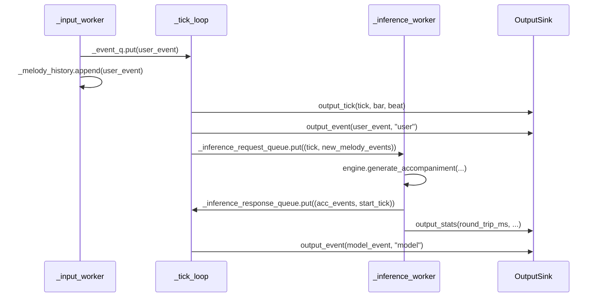

# application/service — RealTimeMusicService

**源文件**：`src/streammuse/application/services/real_time_music_service.py`

`RealTimeMusicService` 是系统的核心编排服务，使用三个线程与三个队列实现实时音乐生成的各阶段并发处理。

---

## `RealTimeServiceRuntime`

```python
@dataclass(frozen=True)
class RealTimeServiceRuntime:
    session_start_time: float
```

运行时状态容器，在 `start()` 调用时创建。

| 字段 | 类型 | 说明 |
|---|---|---|
| `session_start_time` | `float` | 服务启动的 Unix 时间戳，用作 tick 计算的时间基准 |

---

## `RealTimeMusicService`

### `__init__(...)`

```python
def __init__(
    self,
    *,
    input_source: InputSource,
    inference_engine: InferenceEngine,
    output_sink: OutputSink,
    tempo: Tempo,
    scheduler: PlaybackScheduler,
    generation_interval_ticks: int = 2,
    generation_length_frames: int = 20,
    now: Callable[[], float] = time.time,
    sleep: Callable[[float], None] = time.sleep,
) -> None:
```

所有参数均为命名关键字参数（keyword-only）。

| 参数 | 类型 | 默认值 | 说明 |
|---|---|---|---|
| `input_source` | `InputSource` | 必填 | 音乐输入源 |
| `inference_engine` | `InferenceEngine` | 必填 | 推理引擎 |
| `output_sink` | `OutputSink` | 必填 | 输出 Sink |
| `tempo` | `Tempo` | 必填 | 速度配置，决定每 tick 的实时时长 |
| `scheduler` | `PlaybackScheduler` | 必填 | 事件调度器 |
| `generation_interval_ticks` | `int` | `2` | 触发推理的 tick 间隔（每 2 ticks = 每半拍一次） |
| `generation_length_frames` | `int` | `20` | 每次推理生成的帧数 |
| `now` | `Callable[[], float]` | `time.time` | 时间获取函数（可在测试中替换） |
| `sleep` | `Callable[[float], None]` | `time.sleep` | 睡眠函数（可在测试中替换） |

---

### `running` （property）

```python
@property
def running(self) -> bool:
```

返回服务当前是否运行中。

---

## 三个线程

### `_input_worker()` — 输入线程

读取输入事件，将其放入队列。

**行为**：
1. 循环调用 `input_source.read_events()`（阻塞生成器）
2. 对每个事件，用 `tempo.seconds_to_tick(elapsed)` 计算当前 tick（elapsed = 当前时间 - 会话开始时间）
3. 重新构建 `MusicalEvent`，将 `source` 设为 `"user"`
4. 将事件放入 `_event_q`（供 `_tick_loop` 即时播放）
5. 同时追加到 `_melody_history`（供推理请求使用），加 `_melody_history_lock` 保护

**退出条件**：`self._running == False` 或 `read_events()` 生成器结束

---

### `_tick_loop(*, max_ticks)` — 时钟线程

推进音乐时钟，调度播放，触发推理。

**行为**（每 tick 循环）：

1. **时钟同步**：计算目标时间 `start + tempo.tick_to_seconds(tick)`，睡眠直到该时间点（使用 `sleep`）
2. **Tick 回调**：调用 `output_sink.output_tick(tick, bar, beat)`
3. **播放用户事件**：排空 `_event_q`，对每个事件调用 `output_sink.output_event(ev, "user")`
4. **触发推理**：若 `tick - last_generation_tick >= generation_interval_ticks`，仅提取“上次请求之后新增”的旋律事件（由 `_last_sent_index` 跟踪），放入 `_inference_request_queue`
5. **处理推理响应**：排空 `_inference_response_queue`，对每个响应：
   - 调用 `scheduler.clear_future_events(generation_start_tick, source="model")` 清除旧的 model 事件
   - 将新伴奏事件（`source="model"`）通过 `scheduler.schedule()` 安排到对应 tick
6. **播放已调度事件**：调用 `scheduler.get_events_at_tick(tick)` 取当前 tick 的事件，依次调用 `output_sink.output_event(ev, ev.source)`

**退出条件**：`self._running == False` 或 `tick >= max_ticks`（若指定）

---

### `_inference_worker()` — 推理线程

处理推理请求，将结果放回响应队列。

**行为**：
1. 从 `_inference_request_queue` 获取首个请求（含 `generation_start_tick` 和 `melody_events`，timeout=0.1s）。
2. 执行 latest-only drain：继续 `get_nowait()` 排空队列，只保留最新 `generation_start_tick`，并将被跳过请求的 `melody_events` 追加合并，避免中间旋律增量丢失。
3. 调用 `inference_engine.generate_accompaniment(merged_melody_events, latest_generation_start_tick, generation_length_frames)`。
4. 计算 `round_trip_time`（=响应接收时间 - 请求发出时间）。
5. 将 `(acc_events, latest_generation_start_tick)` 放入 `_inference_response_queue`。
6. 调用 `output_sink.output_stats(round_trip_ms=..., server_process_ms=...)`。
7. 若发生队列合并，调用 `output_sink.output_status("debug", ...)` 输出本轮丢弃/合并统计。
8. 若 `hasattr(output_sink, "log_inference")`，调用 `output_sink.log_inference(request=..., response=..., latency_ms=..., server_process_ms=...)`。
9. 若推理抛出异常，调用 `output_sink.output_status("error", str(e))` 并继续运行。

**退出条件**：`self._running == False`

---

## 三线程交互图



---

## `start(*, max_ticks=None) -> None`

```python
def start(self, *, max_ticks: Optional[int] = None) -> None:
```

启动服务：
1. 设置 `_running = True`，创建 `RealTimeServiceRuntime`
2. 调用 `output_sink.output_status("running", "")`
3. 启动三个 daemon 线程（`_input_thread`、`_tick_thread`、`_inference_thread`）

注意：`start()` 是**非阻塞**的（standalone），线程在后台运行。

当前 CLI 实现使用 `while service.running: time.sleep(0.1)` 保持主线程存活。

---

## `stop() -> None`

```python
def stop(self) -> None:
```

停止服务：
1. 设置 `_running = False`
2. 向 `_inference_request_queue` 放入一个 dummy 条目，唤醒阻塞的 inference worker
3. 调用 `input_source.close()` 使 `_input_worker` 的生成器退出
4. 调用 `output_sink.output_status("stopped", "")` 并执行 `output_sink.close()`
5. 依次 join 三个线程，等待它们完成
