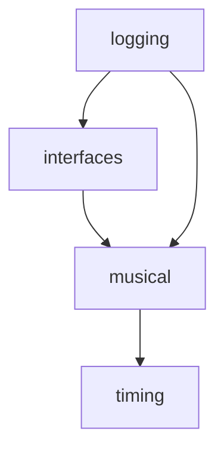

# Domain 层总览

Domain 层是 StreamMUSE 的核心，定义了业务对象、领域接口和约束规则。该层**不依赖任何外部框架**，只使用 Python 标准库。

---

## 职责

- 定义系统的核心数据结构（`MusicalEvent`、`Tempo` 等）
- 声明外部接口的契约（`InputSource`、`OutputSink`、`InferenceEngine` Protocol）
- 封装业务规则（如 `MusicalEvent` 的不变性约束、tick 的语义）
- 提供日志领域对象（`LogEvent`、`InferenceEvent`、`SessionManager`）

---

## 子模块一览

| 子模块 | 路径 | 职责 |
|---|---|---|
| `musical` | `domain/musical/` | 音乐数据类型：`MusicalEvent`、`EventType`、`Note`、转换函数、序列 |
| `timing` | `domain/timing/` | 时间模型：`Tempo`、`MusicalTime`、`PlaybackScheduler` |
| `logging` | `domain/logging/` | 会话日志领域对象：`LogEvent`、`InferenceEvent`、`SessionManager`、`MetricsCalculator` |
| `interfaces` | `domain/interfaces/` | Protocol 定义：`InputSource`、`OutputSink`、`InferenceEngine`、`TimingInfo` |

---

## 子模块依赖关系



- `interfaces` 依赖 `musical`（Protocol 方法签名中使用 `MusicalEvent`）
- `musical` 依赖 `timing`（`MusicalSequence` 持有 `Tempo`）
- `logging` 依赖 `musical`（`LogEvent` 包含 pitch 等音乐字段）

---

## 核心不变性约定

### `MusicalEvent` 不变性

`MusicalEvent` 是 `frozen=True` 的 dataclass，创建后不可修改：

```python
event = MusicalEvent(tick=10, pitch=60, event_type=EventType.NOTE_ON)
event.tick = 20  # 报错：FrozenInstanceError
```

**Placeholder 事件**：`is_placeholder=True` 的事件必须将 `pitch` 设为 `-1`，用于填充空缺的时间位置，不代表真实音符。

### Tick 语义

- 1 tick = 1/`ticks_per_beat` 拍（默认 `ticks_per_beat=4`，即 1 tick = 1/4 拍）
- Tick 是系统内部时间单位，单调递增，从 0 开始
- `Tempo.seconds_per_tick` 给出实时时长

---

## 各子模块详细文档

- [musical — 音乐数据类型](musical.md)
- [timing — 时间与调度](timing.md)
- [logging — 会话日志](logging.md)
- [interfaces — Domain 接口 Protocol](interfaces.md)
