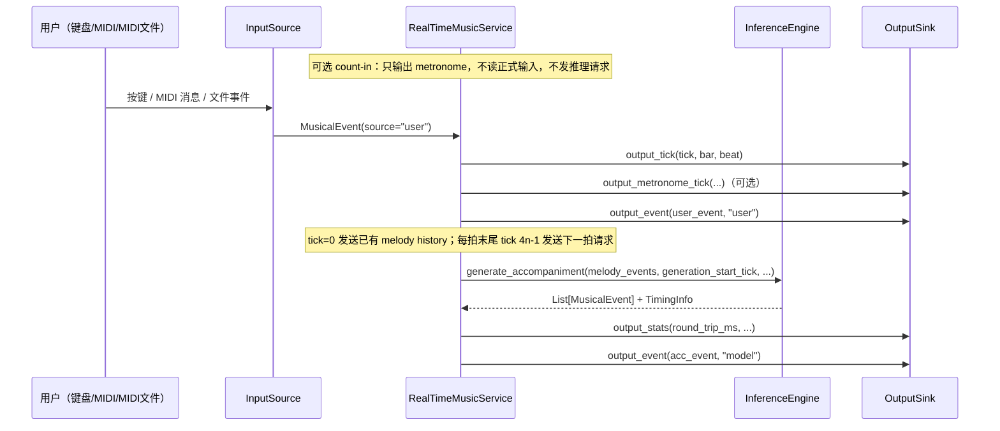
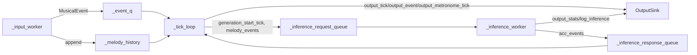

# 架构总览

StreamMUSE 以 **Clean Architecture（洁净架构）** 为设计目标，将系统划分为四个主要层次。

---

## 四层架构图

```
┌─────────────────────────────────────────────────────┐
│              Presentation 层                        │
│   src/streammuse/presentation/                      │
│   CLI 入口，解析参数，创建所有组件                    │
└────────────────────┬────────────────────────────────┘
                     │ 创建 ApplicationConfig
                     ▼
┌─────────────────────────────────────────────────────┐
│              Application 层                         │
│   src/streammuse/application/                       │
│   配置模型、Factory 工厂、RealTimeMusicService 服务  │
└────────────────────┬────────────────────────────────┘
                     │ 服务逻辑依赖 Domain；Factory 负责装配 Infrastructure
                     ▼
┌─────────────────────────────────────────────────────┐
│              Domain 层                              │
│   src/streammuse/domain/                            │
│   MusicalEvent、Tempo、Protocol 定义、日志领域对象   │
└────────────────────▲────────────────────────────────┘
                     │ Infrastructure 实现 Domain 接口
┌─────────────────────────────────────────────────────┐
│              Infrastructure 层                      │
│   src/streammuse/infrastructure/                    │
│   输入设备、输出 Sink、推理引擎的具体实现             │
└─────────────────────────────────────────────────────┘
```

---

## 依赖规则

| 层 | 可以依赖 | 不可依赖 |
|---|---|---|
| Presentation | Application、Domain、少量 Infrastructure 入口工具 | — |
| Application | Domain、Factory 中的 Infrastructure 具体类 | Presentation |
| Domain | 无外部依赖 | 所有其他层 |
| Infrastructure | Domain | Application、Presentation |

**核心原则**：内层（Domain）完全不知道外层的存在。运行时核心服务 `RealTimeMusicService` 通过 Domain Protocol 与输入、输出、推理实现解耦。

---

## 数据流：从输入到输出



当前 tick loop 的推理触发由音乐拍点驱动：默认 `ticks_per_beat=4` 时，tick=0 会用完整历史触发一次请求，之后在 tick=3、7、11... 发送 `generation_start_tick=tick+1` 的请求。`generation_interval_ticks` 仍会透传给 HTTP server 和推理日志，但不再是客户端主循环的触发条件。

---

## 三线程模型

`RealTimeMusicService` 内部运行三个并发线程，通过队列通信：

| 线程 | 职责 | 输入源 | 输出目标 |
|---|---|---|---|
| `_input_worker` | 在正式时间线开始后读取输入，按当前 wall-clock 打 tick | `InputSource.read_events()` | `_event_q`、`_melody_history` |
| `_tick_loop` | 执行 count-in、推进音乐时钟、调度播放、触发推理 | `_event_q`、`_inference_response_queue` | `OutputSink`、`_inference_request_queue` |
| `_inference_worker` | latest-only 调用推理引擎，将结果放回响应队列 | `_inference_request_queue` | `_inference_response_queue`、`OutputSink` |



---

## 关键设计决策

### Protocol 而非 ABC

Domain 层使用 Python `Protocol`（structural subtyping）而非抽象基类（ABC）。好处：

- Infrastructure 实现类无需继承任何基类，减少耦合
- 便于测试时使用 mock 对象或 `MagicMock`
- `InferenceEngine`、`InputSource`、`OutputSink` 均为 Protocol

### 不使用 asyncio

系统选择多线程而非 async/await，原因：

- `python-rtmidi`、`pynput` 等外部库使用阻塞式回调，不适合 async
- 多线程模型更易于理解推理延迟与音乐时钟对齐关系
- 三线程间通过 `queue.Queue` 通信，线程安全且直接

### `log_inference()` 和 `output_metronome_tick()` 是扩展能力

`OutputSink` Protocol 只定义核心输出方法。`log_inference()` 面向日志 Sink，`output_metronome_tick()` 面向 metronome / MIDI 录制扩展，服务层均通过 `hasattr` 检测后调用，避免把所有输出实现强制绑定到同一个功能集合。

---

## 各部分文档导航

| 层 | 文档 |
|---|---|
| Domain | [Domain 层总览](domain/overview.md) |
| Application | [Application 层总览](application/overview.md) |
| Infrastructure | [Infrastructure 层总览](infrastructure/overview.md) |
| Presentation | [Presentation 层总览](presentation/overview.md) |
