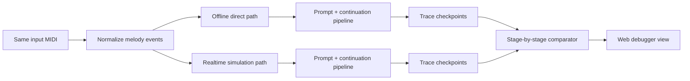

# Replay Debugger Demo Brief

Use this note to quickly explain the new StreamMUSE replay debugger to teammates or mentors.

## One-Sentence Pitch

Real-time music bugs are usually attribution bugs: the model, tokenizer, scheduler, and renderer can all look guilty. The replay debugger turns one vague symptom, "offline and realtime differ," into the first exact pipeline boundary where the two paths stop agreeing.

## Problem It Solves

When a music-generation model works offline but behaves differently in realtime, it is hard to know whether the difference came from input loading, event conversion, prompt selection, tokenization, model generation, decoding, scheduling, or MIDI rendering. The debugger makes those boundaries visible and comparable.

## What It Compares



Each checkpoint records a canonical summary and hash. If the hashes match, both paths produced the same output at that boundary. If they differ, the first red stage is where debugging should begin.

## What To Show In The UI

Open the viewer and point out:

1. **What this screen is proving**: one input melody is replayed through an offline reference path and a realtime-style simulation.
2. **Pipeline map**: shows the high-level flow from input to rendered MIDI.
3. **Result card**: says whether the replay contract holds.
4. **Replay stages rail**: each row is a meaningful checkpoint; the first red row is the first failing boundary.
5. **Selected stage diagnosis**: explains what was compared, the likely subsystem, the previous matched boundary, and the next action.
6. **Detail tabs**: events, tokens, scheduler, and raw details are available without making JSON the main view.

For the current smoke run, the useful message is:

```text
Replay contract holds
16/16 comparable checkpoints matched
No first difference found
```

That means the debugger can already prove the two replay paths agree for this controlled fallback-safe run.

## Demo Commands

Generate a replay:

```bash
.venv/bin/python -m streammuse.presentation.debug.cli replay \
  --scenario lekai-prompt-continuation \
  --midi-file 01_5472152_input_melody.mid \
  --compare offline,sim \
  --output-dir debug_runs \
  --max-tick 16 \
  --timeout-s 20
```

Serve the viewer:

```bash
.venv/bin/python -m streammuse.presentation.debug.server \
  --trace-dir debug_runs/<replay_dir> \
  --host 127.0.0.1 \
  --port 8011
```

Then open:

```text
http://127.0.0.1:8011
```

## Why This Is Valuable

- It turns “offline and realtime are different” into a concrete first mismatch.
- It separates model problems from scheduling, decoding, and rendering problems.
- It gives mentors and teammates a shared visual object to discuss.
- It creates reusable trace artifacts for regression tests and future benchmarking.
- It prepares the system for real LLM/model interaction debugging without adding another duplicated pipeline.

## Current Limitations

What this proves today:

- The replay instrumentation, artifact contract, stage comparator, and UI can verify that the offline reference path and realtime-style simulation produce the same checkpoint outputs for a controlled fallback-safe run.
- The viewer can show the pipeline, result, stage diagnosis, artifact summaries, and event/token/scheduler details from a completed trace directory.

What it does not prove yet:

- It does not prove production HTTP inference, live MIDI timing, model quality, or audio output equivalence.
- Real checkpoint/model runs still depend on the local machine being configured for the Lekai models.
- Richer token, vector, and pianoroll visualizations are still future work.

## Suggested Demo Script

Say:

> “When realtime generation sounds wrong, we usually do not know which layer caused it. This view gives us a pipeline map. We run the same melody through the offline reference path and a realtime-style path, hash each meaningful checkpoint, and jump straight to the first boundary that differs. In this smoke run, all 16 checkpoints match, so the replay plumbing is consistent.”

Then click a few stages:

- `Normalized Melody Events`
- `Prompt Tokenization`
- `Scheduler Status`
- `Output MIDI Render`

Explain that these are the exact boundaries where realtime bugs usually hide.
