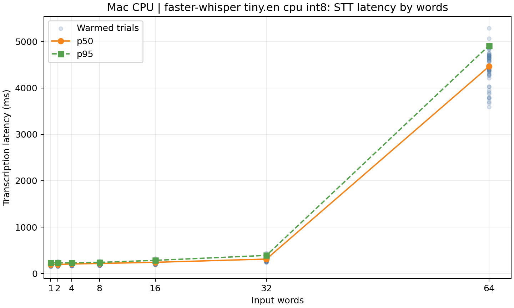
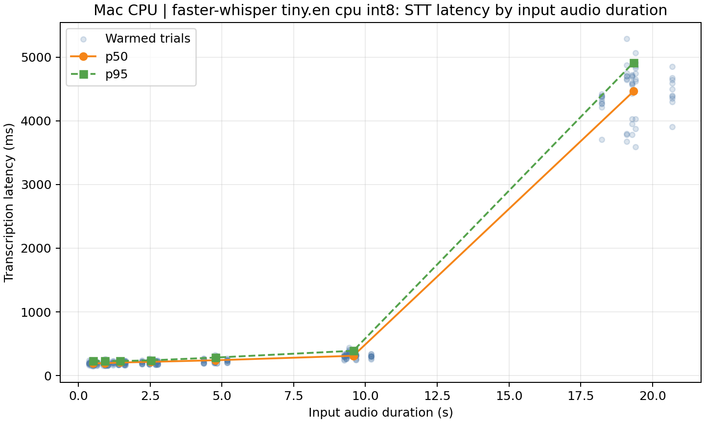
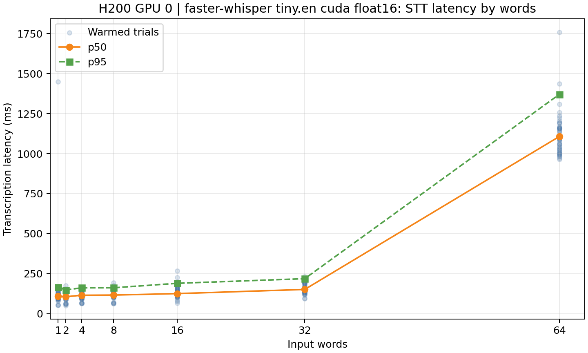
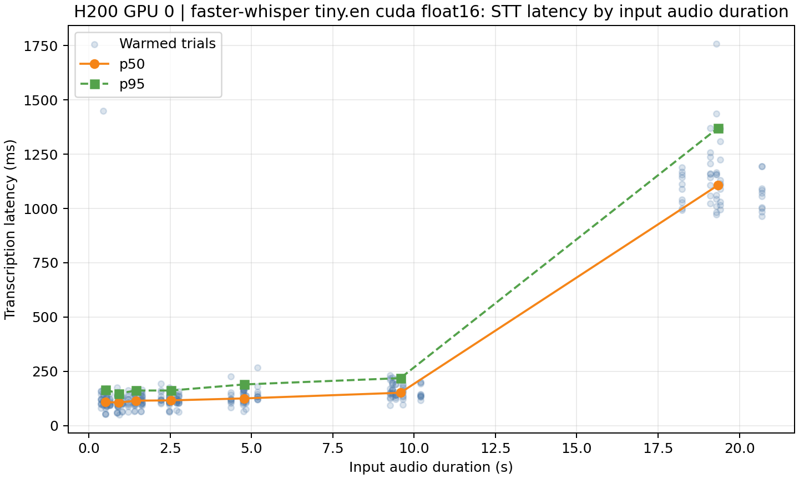
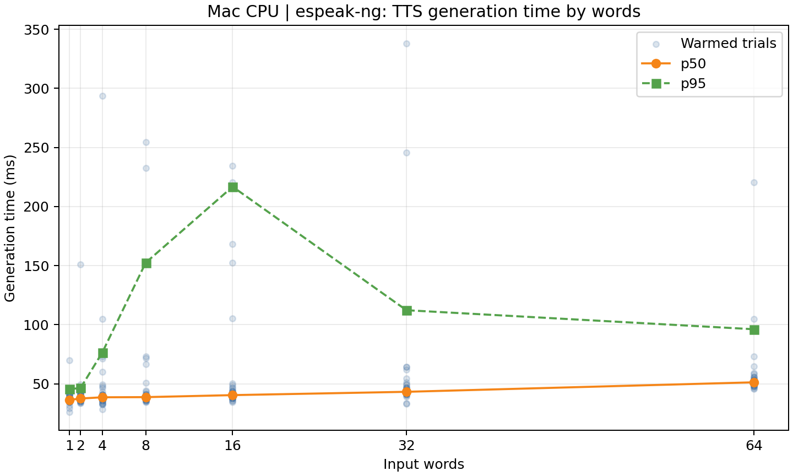
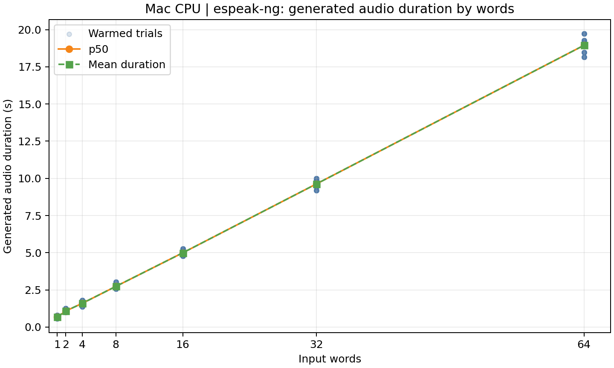
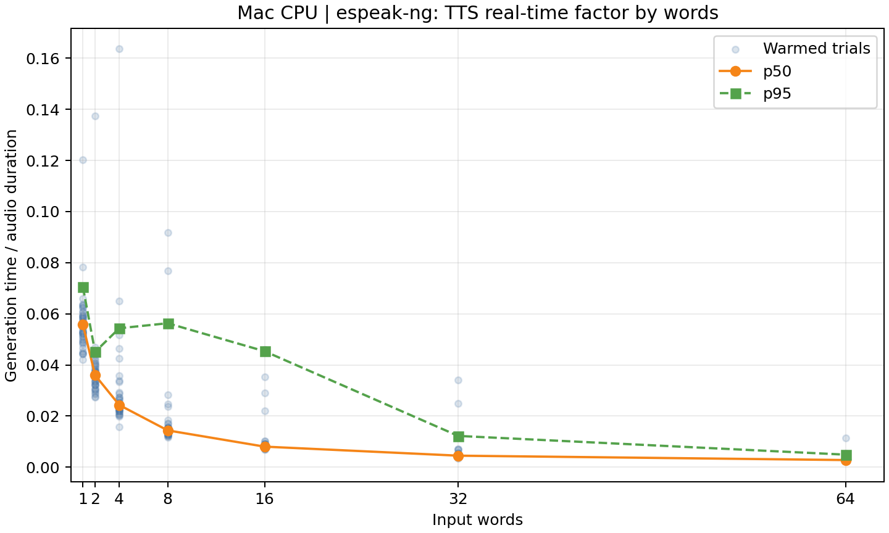
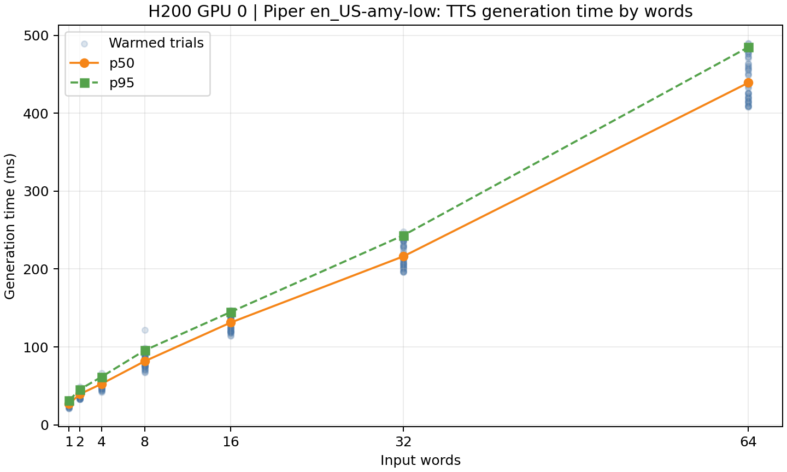
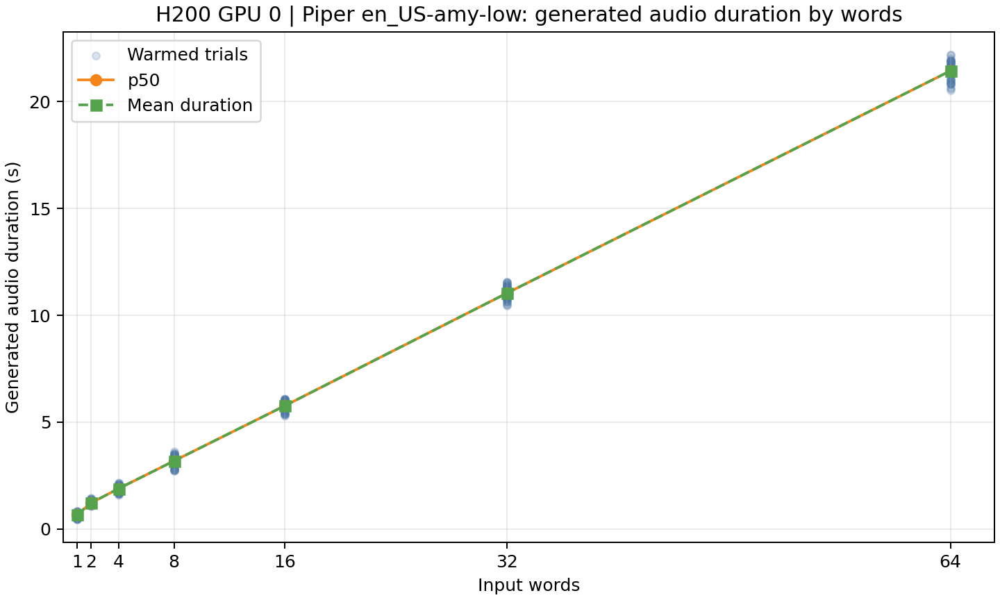
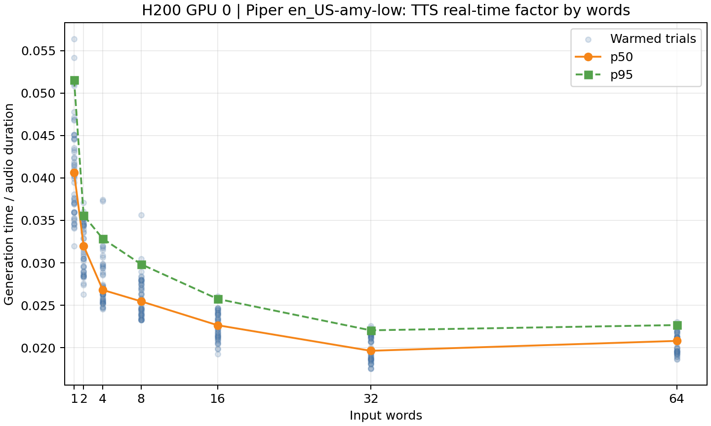

# Voice Length-Sweep Results

Date: 2026-07-17

## Scope

This experiment measures isolated short-form speech conversion, not a full
voice interaction. It excludes microphone capture, VAD/endpointing, speaker
playback, network transport, LLM inference, and StreamMUSE task logic.

The workload uses 1, 2, 4, 8, 16, 32, and 64 input words. Every bucket has
five fixed English sequences and each sequence has ten measured repetitions,
for 350 warmed trials per backend. STT uses the same 35 Mac-generated 16 kHz
WAV files on both machines; their phrase text and input duration are recorded
in each run's `manifest.json`.

The timing phases are deliberately separate:

- `setup`: fresh-process model/client construction until it can accept a request.
- `first request`: the first request after setup.
- `warmed`: all reported p50/p95 values after three unmeasured warmups.
- TTS `generation`: request start until the full WAV has been created.
- TTS `audio duration`: the duration of the generated WAV. It is an output
  property, not a latency measurement.
- `RTF`: generation time divided by generated-audio duration. Below 1.0 means
  synthesis is faster than playback.

## Valid Runs

| Device | STT | TTS |
|---|---|---|
| Mac | faster-whisper `tiny.en`, CPU int8 | `espeak-ng` CLI |
| H200 GPU 0 | faster-whisper `tiny.en`, CUDA float16 | persistent Piper `en_US-amy-low` |

The first H200 combined run is excluded for STT: some samples were locally
generated 0.25-second placeholders while the Mac corpus copy was still
arriving. The corrected H200 STT run used a checksum-verified corpus whose
per-length mean audio durations exactly match the Mac run. The harness now
raises an error when an explicitly supplied `--samples-dir` is incomplete,
instead of generating a substitute sample.

## Setup And First Request

| Device/path | Setup ms | First request ms | Warmed trials |
|---|---:|---:|---:|
| Mac STT, faster-whisper | 2718.7 | 318.8 | 350 |
| H200 STT, faster-whisper GPU | 1715.8 | 347.3 | 350 |
| Mac TTS, espeak-ng CLI | N/A | 369.7 | 350 |
| H200 TTS, Piper | 1296.4 | 340.3 | 350 |

`espeak-ng` has no resident model setup phase. Its first request includes a
fresh command invocation, as does each warmed request. The model-backed paths
need to stay resident for realtime use.

## STT Warmed Latency

Cells show `p50 / p95` in milliseconds. The input duration means are identical
across the Mac and corrected H200 runs.

| Input words | Mean input audio s | Mac CPU p50/p95 ms | H200 GPU p50/p95 ms |
|---:|---:|---:|---:|
| 1 | 0.502 | 191.9 / 228.3 | 108.7 / 165.1 |
| 2 | 0.920 | 193.9 / 229.1 | 106.2 / 148.3 |
| 4 | 1.449 | 204.8 / 228.3 | 115.0 / 161.6 |
| 8 | 2.517 | 215.9 / 239.1 | 116.3 / 161.8 |
| 16 | 4.774 | 240.7 / 282.9 | 125.3 / 189.7 |
| 32 | 9.576 | 310.6 / 389.5 | 151.4 / 218.6 |
| 64 | 19.347 | 4463.6 / 4914.7 | 1107.6 / 1371.2 |

H200 is about 1.8x faster at one word, 2.1x faster at 32 words, and about 4x
faster at 64 words by p50. Both setups miss a one-second STT budget at 64
words; the H200 p95 remains below 220 ms through 32 words.

## Long-Utterance STT Investigation

The H200 64-word row is not a proportional increase in audio preprocessing or
model loading. A follow-up controlled sweep of the same synthetic audio found
a sharp faster-whisper `tiny.en` CUDA decoding transition between 14 and 16
seconds of speech:

| Input audio duration | Default timestamped STT p50 |
|---:|---:|
| 14 s | 144 ms |
| 16 s | 724 ms |
| 18 s | 833 ms |
| 20 s | 927 ms |

Profiling attributed about 3 ms at every duration to encoder work; the added
cost was autoregressive decoder generation. At 14 seconds, the timestamped
decode generated 49 tokens in about 61 ms. At 16 seconds, it generated 59
tokens and decoder time rose to about 727 ms. Disabling timestamps reduced
the 16-18 second range to roughly 0.4 s in the focused test, but did not
guarantee stable behavior for longer utterances. This is a backend/model
decoding characteristic, not the 30-second Whisper chunk boundary.

For text-only realtime use, benchmark `without_timestamps=True`, retain a
strict utterance cap below roughly 12-14 seconds, and investigate streaming
or partial STT for longer user turns. A low `max_new_tokens` cap is not a
solution because it shortened latency by truncating transcripts.

## TTS Generation And Audio Duration

Cells show warmed `generation p50 / p95` in milliseconds. Output duration and
RTF are kept separate so speech length is not mistaken for system latency.

| Words | Mac espeak p50/p95 ms | Mac audio s / RTF p50 | H200 Piper p50/p95 ms | H200 audio s / RTF p50 |
|---:|---:|---:|---:|---:|
| 1 | 36.4 / 45.6 | 0.671 / 0.0557 | 26.9 / 31.4 | 0.666 / 0.0406 |
| 2 | 37.6 / 46.4 | 1.077 / 0.0360 | 39.4 / 45.5 | 1.216 / 0.0320 |
| 4 | 38.6 / 76.4 | 1.600 / 0.0243 | 52.5 / 61.5 | 1.892 / 0.0268 |
| 8 | 38.8 / 152.5 | 2.733 / 0.0144 | 81.6 / 95.5 | 3.188 / 0.0255 |
| 16 | 40.5 / 216.8 | 4.991 / 0.0080 | 131.4 / 144.9 | 5.772 / 0.0226 |
| 32 | 43.3 / 112.3 | 9.628 / 0.0045 | 216.3 / 243.3 | 11.036 / 0.0196 |
| 64 | 51.3 / 96.2 | 18.949 / 0.0028 | 439.3 / 485.0 | 21.442 / 0.0208 |

Piper remains below 0.05 RTF at every tested length: it synthesizes the full
64-word output about 48 times faster than the audio plays. It stays under a
500 ms warmed p95 even at 64 words. Mac `espeak-ng` is the faster low-quality
baseline, but it has larger p95 jitter because every request starts a CLI
process.

## Implications

- A warmed 32-word H200 exchange has a measured p95 budget of about 219 ms
  STT plus 243 ms TTS, before endpointing, model inference, transport, and
  playback. That is a credible base for a one-second turn only if those other
  stages remain tightly bounded.
- 64 words is not compatible with a one-second strict-turn objective using
  whole-utterance STT: H200 STT alone reaches 1.37 s p95. Use a much shorter
  utterance cap, partial/streaming STT, or a more capable ASR setup for that
  scenario.
- Keep the selected models resident. Setup and first-request costs are hundreds
  of milliseconds to seconds, whereas the warmed paths are the relevant
  realtime numbers.
- The next useful measurement is an end-to-end exchange benchmark with real
  capture and endpointing. These results give its speech-only lower bound.

## Plot Assets

| Experiment | Plots |
|---|---|
| Mac STT | [latency by words](assets/voice-length-sweep/mac-stt-latency-by-words.png), [latency by input duration](assets/voice-length-sweep/mac-stt-latency-by-audio-duration.png) |
| H200 STT | [latency by words](assets/voice-length-sweep/h200-stt-latency-by-words.png), [latency by input duration](assets/voice-length-sweep/h200-stt-latency-by-audio-duration.png) |
| Mac TTS | [generation by words](assets/voice-length-sweep/mac-tts-generation-by-words.png), [audio duration by words](assets/voice-length-sweep/mac-tts-audio-duration-by-words.png), [RTF by words](assets/voice-length-sweep/mac-tts-rtf-by-words.png) |
| H200 TTS | [generation by words](assets/voice-length-sweep/h200-tts-generation-by-words.png), [audio duration by words](assets/voice-length-sweep/h200-tts-audio-duration-by-words.png), [RTF by words](assets/voice-length-sweep/h200-tts-rtf-by-words.png) |

## Figures

Word-count plots use a linear, absolute axis with the tested buckets shown as
`1`, `2`, `4`, `8`, `16`, `32`, and `64`. STT duration plots use linear seconds.

### Mac STT

### H200 STT

### Mac TTS

### H200 TTS

## Raw Artifacts

- Mac combined run: `voice_bench_runs/voice_length_sweep_20260717-191300/`
- H200 corrected STT run: `voice_bench_runs/voice_length_sweep_20260717-152132/`
- H200 Piper TTS run: H200
  `/data/home/Andrew.Yang/StreamMUSE/StreamMUSE-v1/voice_bench_runs/voice_length_sweep_20260717-151810/`

The locally copied H200 combined run retains its invalid STT rows for audit,
but this document intentionally uses only its valid Piper TTS rows.
